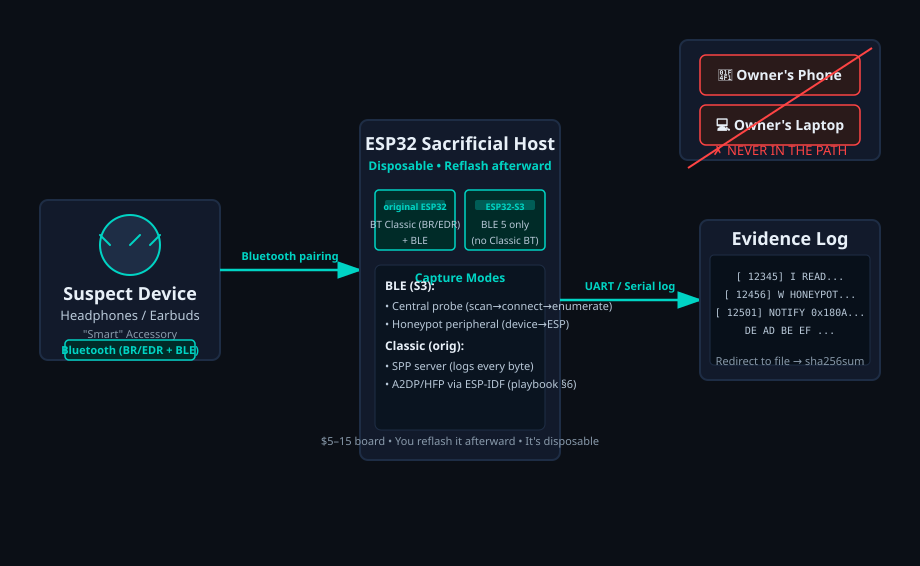
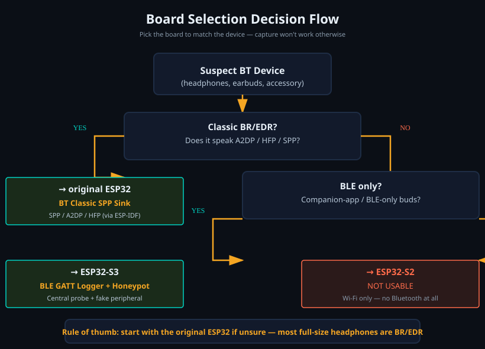
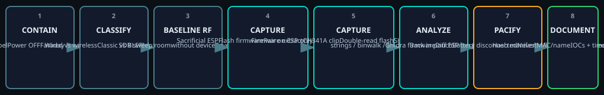

# ESP32 Bluetooth Sacrificial Host

[](https://github.com/savagedamage/esp32-bt-honeypot/actions/workflows/ci.yml)
[](LICENSE)

> Divert the danger to the ESP. Use a cheap, disposable ESP32 as a **sacrificial
> Bluetooth peer** so a suspect Bluetooth device — headphones, earbuds, "smart"
> accessories — never touches your phone, laptop, or anything you care about.
> The ESP32 presents the attack surface, **logs everything the device does**,
> and gets **reflashed afterward**. It's the "take the hit" machine for the
> traffic-capture and firmware-extraction workflow, plus the steps to **pacify**
> (contain / neutralize) whatever malware the device is carrying.



## Why

A hostile Bluetooth device is genuinely dangerous to your real gear and to the
people around it. This project lets you observe and neutralize it without ever
connecting it to hardware you care about:

- **It never touches your phone/laptop.** The ESP32 is the peer; your devices are
  kept out of the path entirely.
- **The ESP is disposable.** A $5–15 board absorbs whatever the device does, you
  read the log, then you reflash it clean (or bin it).
- **Everything is evidence.** The serial log is your capture — redirect it to a
  file and hash it.

## What it is / isn't

**It is** defensive analysis of devices you own or are authorized to examine:
containment, traffic capture, firmware extraction, static/dynamic lab analysis,
and neutralization ("pacify").

**It is not** a tool to reflash a device to exfiltrate to your own C2, or to
extend found malware into exploit chains against other targets.

## The one fact that decides everything

Bluetooth comes in two flavors, and they live on **different silicon**. Pick the
board to match the device, or the capture won't work.

| Board you own | Radio | Use it for |
|---|---|---|
| **original ESP32** (micro-USB, CP2102/CH340) | BT Classic (BR/EDR) **+** BLE | Classic headsets — SPP, A2DP, HFP |
| **ESP32-S3** (USB-C) | **BLE 5 only** — no classic BT | BLE buds / companion-app traffic |
| **ESP32-S2** (USB-C) | Wi-Fi only — no BT at all | not usable here |



> **Rule of thumb:** classic BT headphones → original ESP32. BLE-only buds → S3.
> If you don't know yet, assume classic and start with the original board — most
> full-size headphones are BR/EDR.

## Threat model

An untrusted BT device is usually one of these, all observable without letting it
near your real hardware:

1. **Covert microphone** — records ambient audio, exfils over the HFP/A2DP uplink
   or a hidden SPP/BLE channel.
2. **Data exfil channel** — a hidden SPP server or BLE GATT service that pushes
   captured data (or receives C2) over a profile that shouldn't exist.
3. **C2 implant** — phones home to a C2 over its own radio on schedule. Detected by
   RF sweep, not by pairing.
4. **Companion-app abuse** — a "headphone" whose app demands broad permissions and
   drives the device via BLE GATT. The honeypot catches that GATT traffic.

## How it works — three capture paths

**A. Behaviour capture (the ESP is the peer).** Flash the sacrificial firmware.
The ESP becomes the device's Bluetooth partner and logs the full conversation.

- **BLE (ESP32-S3):** two modes in one firmware —
  - **Central probe** — scan → connect → enumerate every GATT service/char →
    read → subscribe → log notifications. Use once you know the address.
  - **Honeypot peripheral** — advertise and log every read/write/subscribe the
    device makes against *you*. This is the "device attacks the ESP" mode.
- **BT Classic (original ESP32):** SPP server logs every byte. A2DP-sink + HFP-AG
  (audio uplink + AT commands) is the ESP-IDF extension in
  [`docs/pacify-playbook.md`](docs/pacify-playbook.md) §6.

**B. Firmware capture (read the device's own flash).** CH341A clip → `flashrom`
double-read → `strings` / `binwalk` / Ghidra for C2 domains, keys, backdoors. This
finds the implant even when it never transmits during a session. See the playbook
§5.

**C. RF sweep (catches the radio you can't see by pairing).** Baseline the room with
an SDR, power the device in a Faraday enclosure, sweep 1 MHz–6 GHz, diff. Catches
BLE/Wi-Fi/GSM exfil and hidden 2.4 GHz radios.



## Getting started

### Prerequisites

- [PlatformIO](https://platformio.org/) (`pip install platformio` or via your
  preferred installer). Building the firmware needs **no board connected**; you
  only need the board to flash.
- The two target boards above (or just one, depending on the device).

### Build & flash

```sh
cd esp32-bt-honeypot

# BLE logger + honeypot  -> ESP32-S3
pio run -e s3-ble-logger
pio run -e s3-ble-logger -t upload
pio device monitor -e s3-ble-logger > ble-capture.log

# BT Classic SPP sink -> original ESP32
pio run -e esp32-bt-sink
pio run -e esp32-bt-sink -t upload
pio device monitor -e esp32-bt-sink > spp-capture.log
```

The serial log is your evidence — **always redirect it to a file and hash it**
(`sha256sum capture.log`).

### Example serial output

The log is deliberately simple and machine-parseable: timestamped, tagged lines,
with captured bytes hex-dumped 16 per line.

```
==============================================
 ESP32 Bluetooth Sacrificial Host  (v0.1.1)
==============================================
[         0] I Mode: BLE GATT logger + honeypot
[        24] I Honeypot advertising as 'esp32-honeypot' (0x180A + 0xFFF0)
[       246] I Scanning for 8000 ms (active)...
[       249] I   [0] aa:bb:cc:dd:ee:ff  'AirPods'  RSSI=-48
[      3019] I HONEYPOT CONNECT from aa:bb:cc:dd:ee:ff
[      3042] I HONEYPOT write 0000fff1-...  (from aa:bb:cc:dd:ee:ff)
[      3042] W HONEYPOT-WRITE  0000fff1... (4 bytes):
  DE AD BE EF
```

## Configuration

Everything lives in [`src/config.h`](src/config.h). The default build **scans
passively and does not connect** (`BLE_AUTO_CONNECT = 0`), which matches the
empty target. To actively connect and enumerate a specific device:

| Setting | Default | Meaning |
|---|---|---|
| `HONEYPOT_TARGET_MAC` | `""` | Exact MAC to target (e.g. `"aa:bb:cc:dd:ee:ff"`). |
| `HONEYPOT_TARGET_NAME` | `""` | Name substring to target (e.g. `"AirPods"`). |
| `BLE_AUTO_CONNECT` | `0` | `1` = connect + enumerate the matched target; `0` = passive scan only. |
| `BLE_SCAN_MS` | `8000` | Scan window per cycle (ms). |
| `BLE_HONEYPOT` | `1` | Also run the honeypot GATT server. |
| `BLE_HONEYPOT_NAME` | `"esp32-honeypot"` | Advertised name — **set this to the name the victim device expects** to bait it properly. |
| `SPP_NAME` | `"ESP32-Sacrificial"` | BT Classic SPP service name. |
| `SPP_PIN` | `"1234"` | Legacy PIN fallback for pre-2.1 gear. |

> **Bait tip:** for a honeypot to actually trap a device, advertise a name and
> service UUID the device expects (e.g. its companion app's profile). The generic
> `esp32-honeypot` + `0xFFF0` defaults are just scaffolding.

## Operating procedure (per suspect device)

1. **CONTAIN** — photograph + label. Power OFF. Remove battery/SIM if removable.
   Place in a **tested Faraday pouch** (mylar/ESD bags are ~6–9 dB and useless; a
   real pouch is ~90–110 dB).
2. **CLASSIFY** — wired vs wireless; classic vs BLE. Pick the board (§ board table).
3. **BASELINE RF** — sweep the room *without* the device (SDR). Save it.
4. **CAPTURE (sacrificial ESP)** — flash the right firmware, pair **on the ESP only**,
   exercise the device, log.
5. **CAPTURE (firmware)** — CH341A double-read the SPI flash; hashes must match.
6. **ANALYZE** — `strings`/`binwalk`/Ghidra for C2 domains/IPs, hidden profiles,
   exfil paths; diff the ESP log for unexpected GATT/SPP/HFP traffic.
7. **PACIFY** — see the playbook. Minimum: back in the pouch, battery disconnected,
   never reflashed, documented.
8. **DOCUMENT** — hash manifest, MAC/name, firmware hashes, IOCs, timeline → threat brief.

Full detail, including the firmware-extraction commands and the pitfalls, is in
[`docs/pacify-playbook.md`](docs/pacify-playbook.md).

## Testing

The hardware-independent logic is factored into a tiny pure library
([`lib/honeypot_core`](lib/honeypot_core)) and unit-tested on a plain host — no
board needed. CI runs both the unit tests and a full PlatformIO build of each
target on every push / PR.

```sh
# run the unit tests locally (g++ required)
g++ -std=c++17 -I lib/honeypot_core/src tests/test_core.cpp -o /tmp/test_core
/tmp/test_core

# build both firmware targets
pio run -e s3-ble-logger
pio run -e esp32-bt-sink
```

## Known gaps (honest status)

- [x] BLE GATT central logger + honeypot peripheral (NimBLE 2.x, S3) — **compiles clean, verified**
- [x] BT Classic SPP sink (original ESP32) — **compiles clean, verified**
- [ ] A2DP-sink + HFP-AG audio/AT capture — needs ESP-IDF directly (the Arduino core
      exposes only SPP for classic). Example paths in the playbook §6.
- [ ] Full HCI snoop (btmon-equivalent) — the playbook's old `CONFIG_BT_BLUEDROID_LOG`
      note is obsolete; use the transport-tap or VHCI-UART + external-`btmon` route.
- [ ] SD-card logger for long captures (serial is the current sink).

## Contributing

Contributions are welcome! This is a defensive-research tool, and every improvement
helps. Good places to start:

- **Port the ESP-IDF A2DP-sink + HFP-AG extension** (the highest-value add — see
  the playbook §6 and the roadmap). Mark the API calls you can't confirm with
  `VERIFY` rather than guessing.
- **Tighten the honeypot** — add a "victim-like" name/UUID + a minimal reply state
  machine so a device keeps talking instead of disconnecting after one exchange.
- **Bonding/encryption** — currently the central probe can't read encrypted GATT;
  add `secureConnection()` + client callbacks.
- **More unit tests** for `honeypot_core`.

Please open a pull request targeting `main`. Keep changes focused, run the tests
and a full build before submitting, and don't add license headers anywhere unless
you're adding a new file. Secure-by-default and evidence-preserving behavior win
over convenience.

## Related projects

Part of a broader defensive hardware / Bluetooth-security portfolio:

- [keyboard-recon](https://github.com/savagedamage/keyboard-recon) — BLE identity
  scanner for an ESP32-S3 (read-only recon of a wireless keyboard). The reactive
  sibling to this honeypot.
- [esp32-cast](https://github.com/savagedamage/esp32-cast) — ESP32 media-casting,
  for when the ESP isn't playing the bad guy.
- [awesome-hid-security](https://github.com/savagedamage/awesome-hid-security) &
  [hid-security-research](https://github.com/savagedamage/hid-security-research) —
  input-device (USB/HID) security research and defenses.
- [android-security-wizard](https://github.com/savagedamage/android-security-wizard)
  & [pentest-bluestack-toolkit](https://github.com/savagedamage/pentest-bluestack-toolkit) —
  mobile / Android security research suites.

## License

MIT — see [LICENSE](LICENSE).

---

**Author:** [Casey Chambers](https://cormorantcyber.com). Building **Cormorant
Cyber** — a defensive security consultancy focused on mobile & hardware security,
Dubai/UAE. The website is currently in the works; meanwhile you'll find the
published research tools across the repos above.